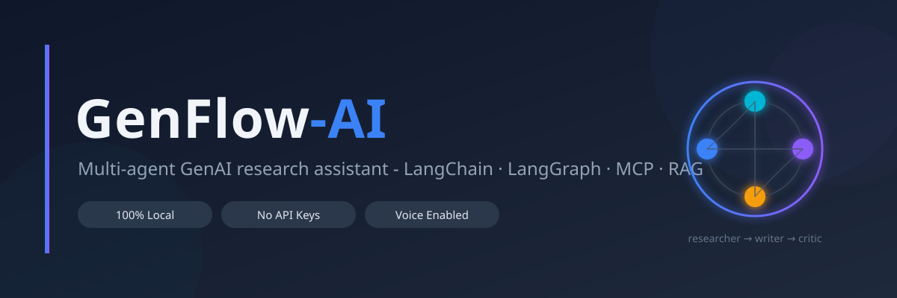
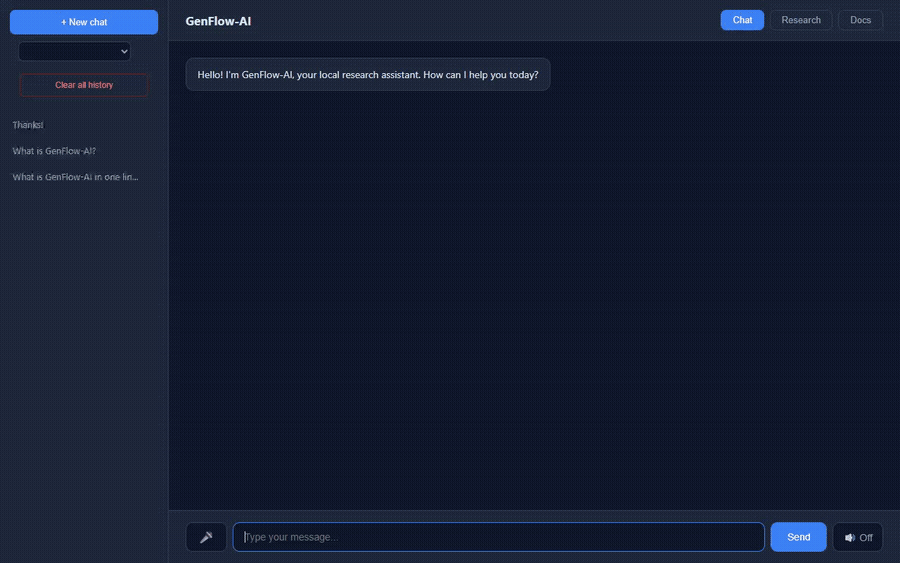
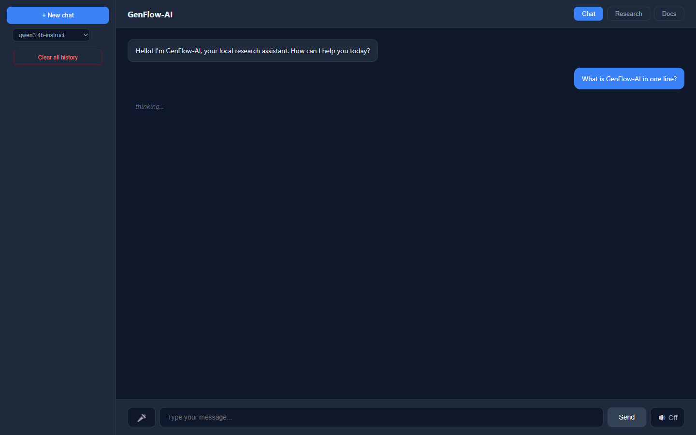
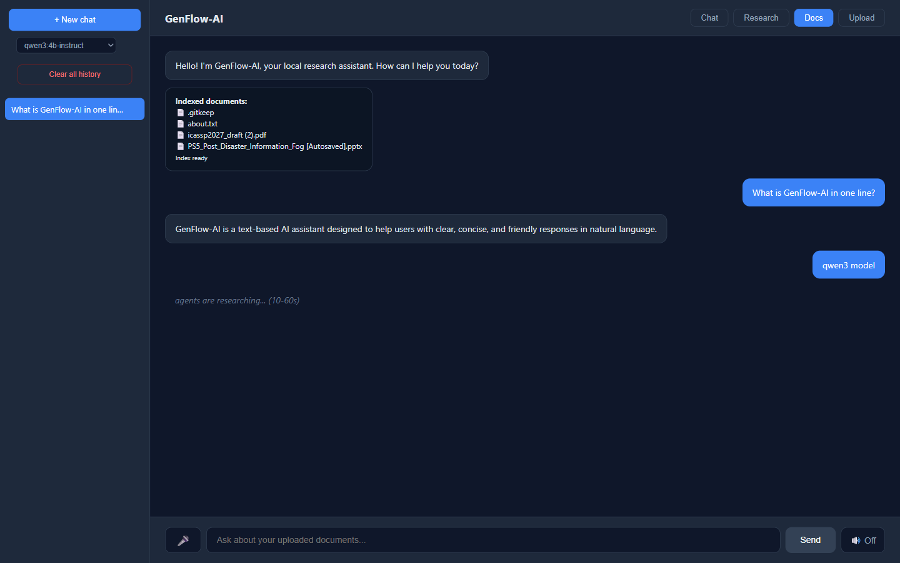
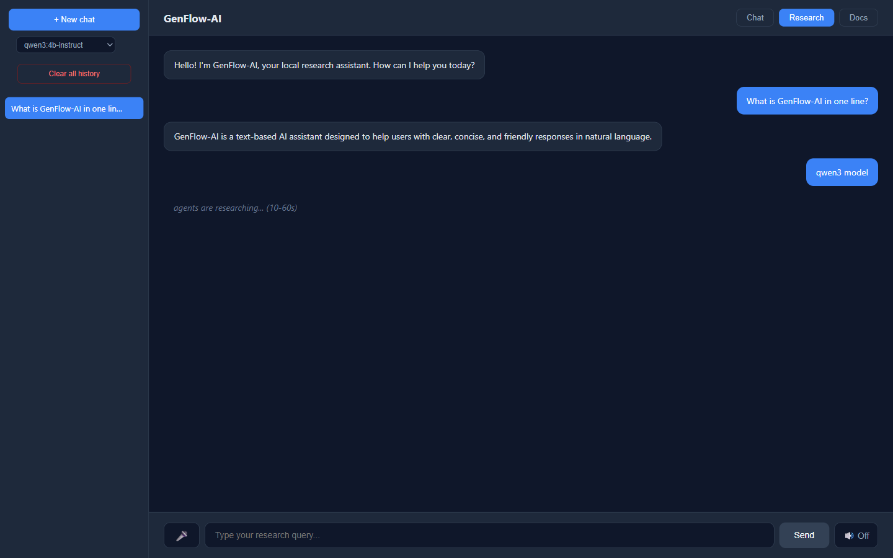

<div align="center">



# GenFlow-AI

**A private, offline AI assistant for Hindi & Hinglish users — fully local, zero API keys.**

[](https://python.org)
[](https://langchain.com)
[](https://langchain-ai.github.io/langgraph/)
[](https://ollama.com)
[](https://fastapi.tiangolo.com)
[](LICENSE)

Chat · Research · Docs (RAG) · Voice.

</div>

---

## Why GenFlow?

Cloud AI is expensive, English-first, and uploads your documents to third-party servers. GenFlow runs **entirely on your own CPU** — no API keys, no per-token fees, and nothing ever leaves your machine.

It is built for the users the current AI stack leaves out:

- **Privacy-first workplaces** — clinics, schools, government offices and small businesses that cannot (or will not) upload sensitive documents to a foreign API.
- **Hindi & Hinglish speakers** — ask in Roman-letter Hindi (`is document mein tax ka rule kya hai?`) and get a natural Hinglish reply; speak in Hindi and get a spoken Hindi answer.

Upload your own PDFs, PPTX or notes and query them in your own language, run multi-agent research reports, or just chat — all offline, on an ordinary laptop.

## Features

| Feature | Description |
|---|---|
| **Chat** | Conversational AI with memory + persistent history (JSON store) |
| **Research** | Multi-agent pipeline: researcher (ReAct + tools) → writer → critic loop; grounds in your uploaded documents |
| **Docs (RAG)** | Upload PDF / PPTX / TXT / MD — ask questions answered from your documents |
| **Voice** | Local Whisper speech-to-text (mic) + browser text-to-speech |
| **Hindi / Hinglish** | Roman typing → Hinglish reply; Hindi speech → natural Hindi reply |
| **Chat sidebar** | ChatGPT-style: list, open, rename (double-click), delete, new chat |
| **Model switcher** | UI dropdown — switch Ollama models anytime (qwen3:1.7b / 4b-instruct) |
| **Resilient** | Auto-retry with exponential backoff on engine overload; friendly error messages |

## Architecture

```
Browser UI (sidebar, chat, tabs)
   │
FastAPI server  ──  store.py (data/chats.json — chat history)
   │
 ├─ Chat flow     → LangChain → Ollama (qwen3:4b-instruct)
 ├─ Research flow → LangGraph: researcher (MCP tools) → writer → critic
 ├─ Docs flow     → RAG: nomic-embed-text + InMemoryVectorStore
 └─ Voice         → faster-whisper (local STT)
   │
 Ollama (localhost:11434) — all models local
```

<details>
<summary><b>Project structure</b></summary>

```
GenFlow-AI/
├── src/genflow/
│   ├── agents/
│   │   ├── research_graph.py   # LangGraph multi-agent pipeline
│   │   ├── react_graph.py      # generic ReAct tool-calling graph
│   │   └── state.py            # ResearchState
│   ├── mcp_tools/
│   │   ├── server.py           # MCP server (FastMCP)
│   │   └── client.py           # langchain-mcp-adapters client
│   ├── flows/research_flow.py  # chat + research entrypoints
│   ├── ui/
│   │   ├── server.py           # FastAPI app (all endpoints)
│   │   └── static/index.html   # web UI
│   ├── rag.py                  # RAG: ingest, search, answer
│   ├── stt.py                  # Whisper speech-to-text
│   ├── store.py                # chat history (JSON)
│   ├── llm.py                  # Ollama client + retry logic
│   ├── config.py               # settings (.env)
│   └── cli.py                  # `genflow` command
├── data/
│   ├── docs/                   # uploaded documents (RAG) — gitignored
│   └── chats.json              # chat history — gitignored
└── tests/
```

</details>

## Setup

### 1. Requirements

- Python 3.10+
- [Ollama](https://ollama.com/download) installed and running

### 2. Install

```powershell
py -3.12 -m venv .venv
.\.venv\Scripts\pip install -e ".[dev]"
ollama pull qwen3:4b-instruct
ollama pull nomic-embed-text   # RAG embeddings
```

### 3. Configure (optional)

`.env` — defaults shown:

```env
GENFLOW_MODEL=qwen3:4b-instruct
GENFLOW_BASE_URL=http://localhost:11434
GENFLOW_TEMPERATURE=0.2
```

Optional: set `GENFLOW_PASSWORD` to lock chat history behind a password.

## Run

```powershell
.\.venv\Scripts\Activate.ps1
genflow serve                  # UI: http://127.0.0.1:8000
genflow chat "hello"           # CLI quick chat
genflow research "topic"       # CLI multi-agent research
```

LAN access (other devices on your network):

```powershell
genflow serve 0.0.0.0 8000
```

## Use

1. **Chat tab** — type your question (mic button to speak it, speaker toggle for spoken answers)
2. **Research tab** — deep multi-agent reports (2-5 min: researcher → writer → critic loop). The researcher searches your indexed documents, so upload files in the Docs tab first for grounded reports
3. **Docs tab** — upload PDF/PPTX/TXT, then ask anything about them; filename mentions are routed to that exact file
4. **Sidebar** — history: click to open, double-click to rename, x to delete, + for new chat
5. **Model dropdown** (top-left) — switch models anytime

## Demo



*Real recording: ask a question in the Chat tab → reply generated by the local Ollama model → switch to the Docs tab and ask about an uploaded file. Fully local, no API keys.*

## Screenshots

| Chat | Docs (RAG) |
|---|---|
|  |  |



## API Endpoints

| Method | Path | Description |
|---|---|---|
| `POST` | `/api/chat` | Chat reply (with history) |
| `POST` | `/api/research` | Multi-agent research report |
| `POST` | `/api/rag/upload` | Upload document for RAG |
| `POST` | `/api/rag/ask` | Ask question over indexed docs |
| `POST` | `/api/rag/ingest` | Re-index documents folder |
| `POST` | `/api/stt` | Speech-to-text (audio file) |
| `GET/POST` | `/api/models`, `/api/model` | List / switch Ollama models |
| `GET/POST/...` | `/api/chats` | Chat history CRUD |

## Test / Lint

```powershell
.\.venv\Scripts\python.exe -m pytest tests -q
.\.venv\Scripts\python.exe -m ruff check src tests
```

## Deploy

The project ships with a `Dockerfile` that bundles Ollama + the app in a single container, so it can run anywhere Docker runs (cloud VM, Render, Railway, Cloud Run, Hugging Face Spaces, your own server).

**Run with Docker (anywhere):**

```powershell
docker build -t genflow-ai .
docker run -p 7860:7860 genflow-ai
# UI: http://localhost:7860
```

**Hugging Face Spaces** (note: Docker Spaces now require a PRO account; the `hf-space/` folder is push-ready if you have one):

```powershell
# 1. hf.co -> New Space -> SDK: Docker -> name: GenFlow-AI
# 2. Token: hf.co/settings/tokens (write access)
huggingface-cli login
git clone https://huggingface.co/spaces/<username>/GenFlow-AI hf-deploy
# 3. Copy the contents of hf-space/ into hf-deploy/
# 4. Push:
git -C hf-deploy add -A; git -C hf-deploy commit -m "Deploy"; git -C hf-deploy push
```

**Environment variables** (all optional, defaults shown for local dev):

| Variable | Default | Description |
|---|---|---|
| `GENFLOW_MODEL` | `qwen3:4b-instruct` | Ollama model |
| `GENFLOW_BASE_URL` | `http://localhost:11434` | Ollama server |
| `GENFLOW_DATA_DIR` | `./data` | chats.json + docs/ + index.json location |
| `GENFLOW_NUM_PREDICT` | `400` | Max tokens per reply |
| `GENFLOW_NUM_CTX` | `2048` | Context window |
| `GENFLOW_PASSWORD` | *(empty)* | Chat history lock (UI password) |

## Tech Stack

**Backend:** Python · FastAPI · LangChain · LangGraph · langchain-mcp-adapters · MCP (FastMCP) · langchain-ollama
**AI:** Ollama (qwen3) · nomic-embed-text (embeddings) · faster-whisper (STT)
**Frontend:** Vanilla JS + CSS (single-file, no build step)
**Storage:** JSON (chats) · InMemoryVectorStore + JSON dump (RAG index)

## Notes

- All inference local: Ollama (qwen3) + Whisper — no API keys, unlimited usage, full privacy
- Uploaded documents and chat history stay in `data/` — never pushed to git (see `.gitignore`)
- RAM: 8GB+ recommended (4b model ~3GB); close heavy browser tabs for best speed
- Voice input needs mic permission (browser); STT runs locally via faster-whisper

## License

MIT — see [LICENSE](LICENSE)

## Author

**Mandavi Singh** — [GitHub](https://github.com/mandavi-singh)

<div align="center">
Made with Python, LangGraph and fully-local AI
</div>
